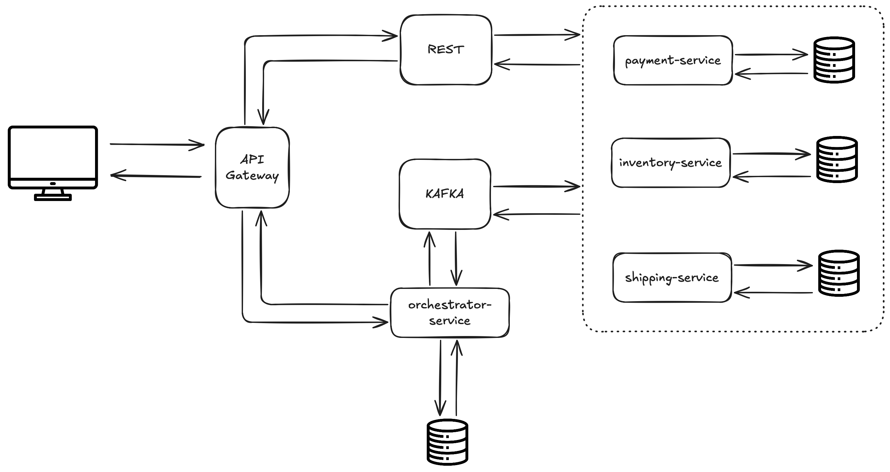

## Saga Experiment



## Getting Started

### Docker
To start docker services, cd into `docker` folder
```sh
docker-compose up -d
```
   
### Run Application
To run the application, cd into each folder, and just run `mvn`


### Failure simulation
`POST http://127.0.0.1:8000/orchestrator/api/items`
```json
{
    "itemId": <get from inventory-service>,
    "quantity": <get from inventory-service>,
    "price": <get from inventory-service>,
    "transactionType": <PAYMENT_ONLINE | PAYMENT_QR>,
    "failurePoint": "payment | inventory | shipping" <- choose which service to fail, if empty all steps will be executed
}
```

## Built With

* [Quarkus](https://quarkus.io)
* [Apache Kafka](https://kafka.apache.org)
* [PostgreSQL](https://www.postgresql.org)

## TODO

- [x] Initial prototype
- [ ] Share common module
- [ ] Add integration tests
- [ ] Stress testing
